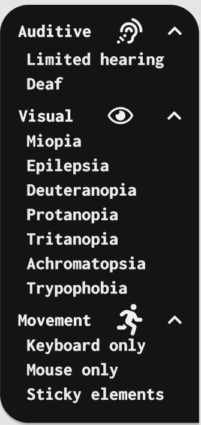

# Visi (Smart Visual Assistant)
- [Description](#description)
- [Interface](#interface)
- [Usage](#usage)
- [Personas](#personas)
- [Contributor](#contributor)

## [Description](#)
Visi is a smart assistant for people with special needs. It includes auditive, visual and kinetic modifications of a web page.

## [Interface](#)
The assistant can be found in the bottom right corner of the page as a droplet. When clicking on it, a menu pop-up will appear, from where you can select the desired condition.

The conditions are separated as follows: auditive, visual and kinetic. The text is also accompanied by respective icons.

The text has a large font size as well as readable font, making sure even people with poor vision would be able to read it.

The colors are plain and simple, and the most importantly, contrast.

All the clickable interactions will be accompanied by a beeping sound of a different tone and pitch, followed by a voice reading the text under the pointer, making sure the people with vision problems could use it without any problems.

An image of the interface is shown below:

## [Usage](#)

### [Auditive](#)
Auditive section includes making subtitle captions for videos.

#### [Limited Hearing](#)
This mode will adjust the volume to a higher volume, but will also insert the subtitles for the video.

#### [Deaf](#)
This mode will lower the volume and will insert subtitles for the video (if there is any).

### [Visual](#)
Visual effects are more vague, and it includes small changes such as removing all the images (for people suffering from trypophobia) as well as modifying the web page in such a way it's more readable for people having problems reading the text.

#### [Miopia](#)
This mode will increase the font size, changing the page in such a way it's readable even for people having a hard time seeing.

#### [Epilepsia](#)
This mode will reduce the animation speed or remove animations at all.

#### [Color Blindness](#)
In this mode, the image colors are shifted in such a way it's more readable for people suffering from different type of color blindness, such as: deuteranopia, protanopia, tritanopia, achromatopsia.

#### [Trypophobia](#)
For people suffering from trypophobia or similar conditions that might be triggered by images, this mode will turn all the images off, replacing them with grey blocks instead.

### [Kinetic](#)
These effects are designed for people having difficulties using the physical devices due to tremors and similar medical conditions.

#### [Keyboard/Mouse Only](#)
For people having troubles using one or the other device, this mode will adapt the web page in such a way it's more comfortable using the other.

#### [Sticky Elements](#)
This mode will turn "sticky" elements on, making the cursor be glued to the buttons and links. It will help people with tremors overcome the frustration of aiming at small elements on the web page and will keep the content intact.

## [Personas](#)
More information about personas can be found below:

 - [First primary persona](persona/first_primary_persona.html)
 - [Second primary persona](persona/second_primary_persona.html)
 - [Third primary persona](persona/third_primary_persona.html)
 - [Secondary persona](persona/secondary_persona.html)

## [Contributor](#)
Gheorghița Vlad