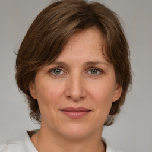

[back](../index.html)

# Second Primary Persona

## Name:
Ariane Arax

## Background:

### Date of Birth:
August 30, 1988

### Gender:
Feminine

### Location:
North Rhine-Westphalia, Germany

### Work Place:
Finance Consultant, Gelsenwasser

### School:
University of Munster, Germany

### Technology Level:
Intermediate

## Main Points:
- Intelligent;
- Color blind.

## Detailed Information:
After finishing the university, Ariane managed to get a job at Gelsenwasser as a finance consultant. She was born with tritanopia, a type of color blindness. It wasn't a huge issue for her job, as she worked mostly with excel documents or paper, but she would want to distinguish better images on the internet.

## Goals:
- Better distinguish nuances of images and videos of web pages.

## Frustrations and Pain Points:
- Numbers;
- Blue/green images;
- Purple/red images;
- Yellow/red images.

## Scenarios:
Use the application to read the details of videos and images better.